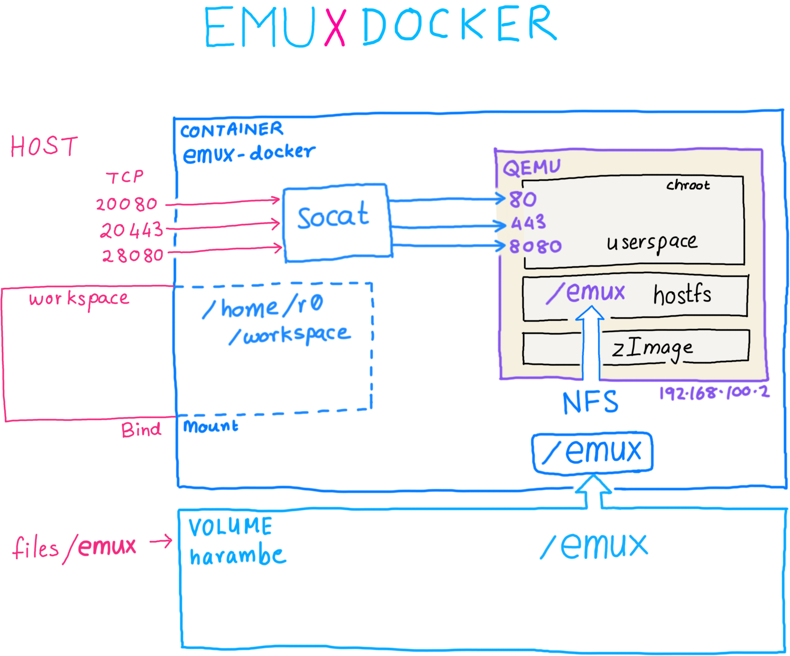
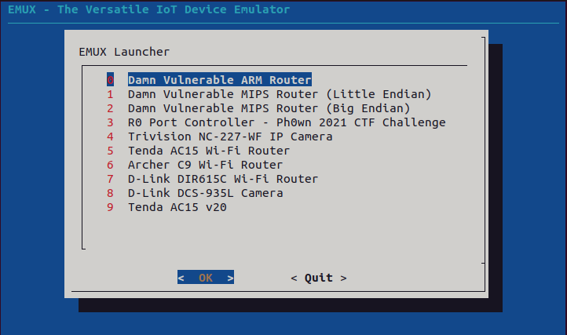

## Tutorial1: Ảo hóa thiết bị với EMU-X

### 1.Cài đặt

> Step 0 - Ensure that Docker is installed and running!
Test if Docker is working by running hello-world

Note: Ubuntu (and other Linux distros) users, ensure that your current user has privileges to run Docker as an administrator:
```
sudo groupadd docker
sudo gpasswd -a $USER docker
sudo usermod -aG docker $USER
```
>Step 1 - Clone the EMUX repository

```
git clone --depth 1 --single-branch  https://github.com/therealsaumil/emux.git
```
> Step 2 - Build the EMUX docker volume and image
```
cd emux
./build-emux-volume
./build-emux-docker
```

> Step 3 - Run EMUX!
Open a terminal, and start the emux-docker container:
```
./run-emux-docker

```

Next, start the EMUX launcher:
```
[EMUX-DOCKER 🐳:~$] launcher
```
and select any emulated device that you wish to run.


>Step 4 - Launch the emulated device's userland processes.
Next, open a new terminal and attach to the running emux-docker container:
```
./emux-docker-shell
```
All attached container shells have a blue shell prompt. Invoke the userspace command to bring up the userland processes of the emulated target:
```
[emux-docker shell 🐚:~$] userspace
```
Để đọc thêm chi tiết có thể truy cập: https://github.com/therealsaumil/emux

### 2. Giới thiệu và hướng dẫn sử dụng

>Thông tin về kết nối mạng từ host tới guest qemu:



> Các bước ảo hóa một thiết bị

1. Tạo thư mục thiết bị trong EMUX.
2. Chọn một kernel phù hợp với kiến trúc của thiết bị.
3. Sao chép rootfs/squashfs-root vào thư mục thiết bị.
4. Chỉnh sửa config.
5. Tạo bản ghi về thiết bị trong/emux/devices

>2.1 Tạo thư mục thiết bị 
```
$ cd /emux/
$ cp -r template TENDA
```
Note: trong đó template là folder chứa các file mẫu

>2.2 Sao chép hệ thống tệp gốc
Di chuyển thư mục squashfs-root/rootfs được trích xuất bởi binwalk từ firmware của thiết bị.

>2.3 nvram.ini
Vì chúng tôi không có nội dung của nvram, chúng tôi sẽ để nguyên trạng nvram.ini. Sau đó, chúng tôi sẽ điền nvram.inikhi chúng tôi hiểu rõ hơn về quá trình khởi động Tenda.

>2.4 Chỉnh sửa tệp cấu hình

VD:
Nội dung của /emux/TENDA/config:

 Tenda AC15 EMUX configuration
```
id=TENDA
nvram=nvram.ini
rootfs=squashfs-root
randomize_va_space=0
initcommands="/etc_ro/init.d/rcS;/bin/sh"
```

>2.5 Tạo bản ghi trong /emux/ devices
```
TENDA,qemu-system-arm-6.0.0,vexpress-a9,,,256M,zImage-2.6.39.4-vexpress,VEXPRESS2,Tenda AC15 Wi-Fi Router
```
>2.6 Khởi động 
VD: Có folder thiết bị tên tenda

Thư /emux/TENDA mục trông giống như sau:

```
/emux/TENDA
       |
       |--- config
       |--- kernel
       |      |
       |      `--- zImage-2.6.39.4-vexpress
       |
       |--- nvram.ini
       `--- squashfs-root
Khởi động Trình khởi chạy EMUX với nhân Tenda AC15
```
Trình khởi chạy EMUX cho Tenda AC15

Từ giao diện EMUX Docker, Khởi chạy thiết bị


